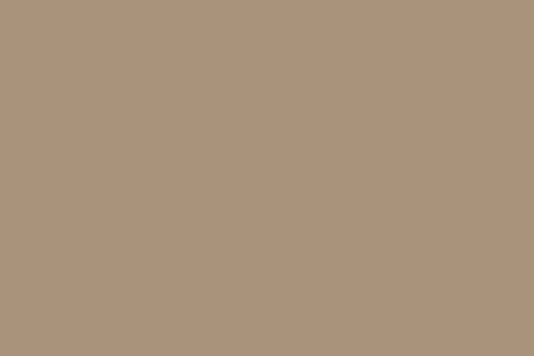
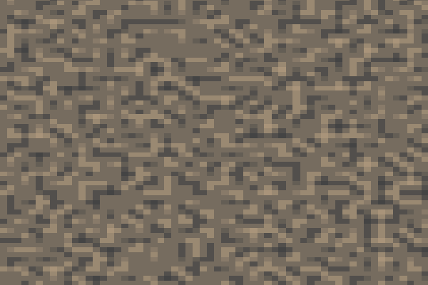
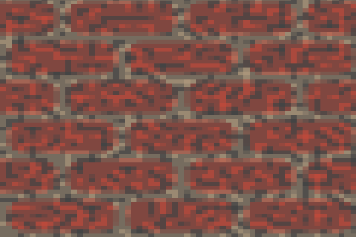
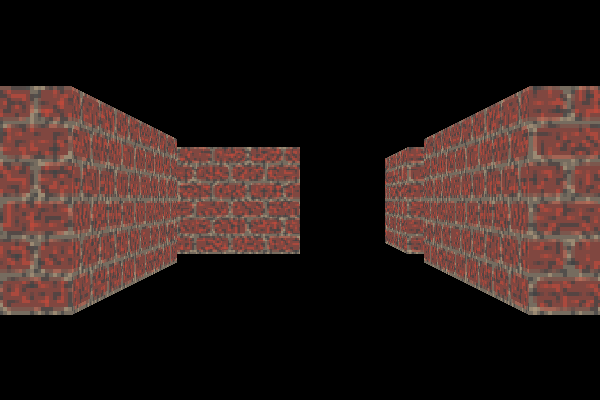
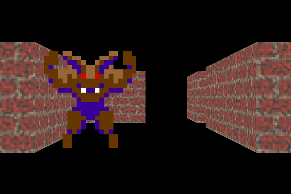

RPU is a procedural 2D and 3D scene definition language with integrated scripting and shaders. RPU is under active and early stages of development.

RPU utilizes a software renderer and is aimed at 2D and 3D content creation as well as rendering pretty pictures.

See below for examples.

## Goals

* Create 2D and 3D content for visualization or games by modeling with analytical and SDF primitives.
* Create procedural textures including material attributes and normals for both high-quality as well as retro experiences.
* Creating an ecosystem for sharing RPU content (materials, objects, scenes) via an integrated database.
* Render pretty pictures utlilizing various renderers.

## Non-Goals

* Although I will use RPU for rendering dungeons and scenes for my retro RPG creator [Eldiron](https://github.com/markusmoenig/Eldiron) it is not aimed at being a realtime renderer.
* RPU will output meshes for procedural 3D content but will not process them or model with meshes.

## Usage

You can use RPU in various ways:

* Edit RPU files with your favourite editor and use rpuc to compile them, view your content and save it to disk.
* An upcoming *RPU Creator* app will provide an integrated IDE for working with your RPU files featuring context help and live previews.
* Embed RPU source files in your app or game and create images live via the RPU crate.

## Not for Artists

RPU is meant as a tool for programmers and is not artist friendly by design. It is meant to be a tool which empowers developers to create their own art for their projects.

## Examples

# Texture Creation

Let's start with a solid dark beige color.

```rust
Texture*       // The * star outputs this texture.
    Color
        color = #a9957b
```


The texture has a solid color layer of a dark beige color.

In the next step we add a noise layer and pixelate the texture 60%.

```rust
Texture*
    pixelate = 60.0
    Color
        color = #a9957b
    Noise
        color = #444444
        scale = F2(1.0, 1.0)
```



The noise color is blended on the background. By default the noise layer uses *Perlin* noise.

Now lets add some bricks:

```rust
Texture*
    pixelate = 60.0
    Color
        color = #a9957b
    Bricks
        color = #bc4a3c
    Noise
        color = #444444
        scale = F2(1.0, 1.0)
```



This creates a tileable brick layer on top of the color layer. The noise is applied as the last step.

Layers, like the brick and noise layers in this example, have many different options which are explained in detail in the upcoming RPU book.

Also textures can contain material attributes and can output material and normal maps, to be documented soon.

# Simple Dungeon

Let's take the simple texture we created and apply it to a basic dungeon scene. For this we add a camera a voxel, and a 3D grid.

```rust
Pinhole
    origin = F3(3.0, 0.5, 9.5)
    center = F3(3.0, 0.5, 0.0)

Texture
    name = "Bricks"
    pixelate = 60.0
    Color
        color = #a9957b
    Bricks
        color = #BC4A3C
    Noise
        color = #444444
        scale = F2(1.0, 1.0)

Voxel'a
    texture = "Bricks"

Grid3D
:    a
:aaa a
:
: a  a
: a  a
: a  a
```

Notice that we removed the * from the texture, now RPU renders the last layout in the source which in this case is a 3D grid. The grid has one level of tiles in the xz plane.



### Sprites

In the last step, lets add an image based monster to the scene. We call them sprites.

```rust
Pinhole
    origin = F3(3.0, 0.5001, 9.5)
    center = F3(3.0, 0.5, 0.0)

Texture
    name = "Bricks"
    pixelate = 60.0
    Color
        color = #a9957b
    Bricks
        color = #BC4A3C
    Noise
        color = #444444
        scale = F2(1.0, 1.0)

Texture
    name = "Monster"
    data = "iVBORw0KGgoAAAANSUhEUgAAABgAAAAYCAYAAADgdz34AAAABGdBTUEAALGPC/xhBQAAACBjSFJNAAB6JgAAgIQAAPoAAACA6AAAdTAAAOpgAAA6mAAAF3CculE8AAAAUGVYSWZNTQAqAAAACAACARIAAwAAAAEAAQAAh2kABAAAAAEAAAAmAAAAAAADoAEAAwAAAAEAAQAAoAIABAAAAAEAAAAYoAMABAAAAAEAAAAYAAAAAPDoW7MAAAFZaVRYdFhNTDpjb20uYWRvYmUueG1wAAAAAAA8eDp4bXBtZXRhIHhtbG5zOng9ImFkb2JlOm5zOm1ldGEvIiB4OnhtcHRrPSJYTVAgQ29yZSA2LjAuMCI+CiAgIDxyZGY6UkRGIHhtbG5zOnJkZj0iaHR0cDovL3d3dy53My5vcmcvMTk5OS8wMi8yMi1yZGYtc3ludGF4LW5zIyI+CiAgICAgIDxyZGY6RGVzY3JpcHRpb24gcmRmOmFib3V0PSIiCiAgICAgICAgICAgIHhtbG5zOnRpZmY9Imh0dHA6Ly9ucy5hZG9iZS5jb20vdGlmZi8xLjAvIj4KICAgICAgICAgPHRpZmY6T3JpZW50YXRpb24+MTwvdGlmZjpPcmllbnRhdGlvbj4KICAgICAgPC9yZGY6RGVzY3JpcHRpb24+CiAgIDwvcmRmOlJERj4KPC94OnhtcG1ldGE+Chle4QcAAAF2SURBVEgN3VRBboMwEFyq/gepB/IeDlTlBX0KUTnkPfEhUl7kegxrxtY6cEgusRRYdmdnvGMrIm+1hk48fhhqGjqP396AjON+7fvUQIn1+zL30nZjFEJunF2jNbxV/HZ3cndTyLhUBtfsJOKTQKqugZOxETf50J+EVATkG3EfqAO2sj44j52oMvL9cIll5EGodmzkGwZA9C7TxLb4yCaAJa2I/2q7hIAI7LKWboDtCmZm0DQB71wR2CkWhH83i2OMHJZi4sf6YK7Mu04mr42YwmpmIo0ZC4v4TNIEAHOByUtfgeUcY5kDuGwCJLAwyRIt9iD+u3o5NeeYvvof+T4trSxUkgNsCkSW9cG2cR5xaUdZx/euAECWyBFy9GbXFInaYitqGCu/OwGfh0Vg+c64hwL8/1ROoNcZZHzvmRxxdk3LIn8zIceMseLDAnqosKScxiLW3GEBbXjqGweMc7AO+lHt0CZAzIdca9rDvdyilwvUJn9a/h+9kLeXa8PDYAAAAABJRU5ErkJggg=="

Voxel'a
    texture = "Bricks"

Sprite
    texture = "Monster"
    position = F3(2.0, 0.0, 5.0)

Grid3D
:    a
:aaa a
:
: a  a
: a  a
: a  a
```



Scary isn't he ? We loaded the texture for the sprite from a JSON encoded PNG file placed the sprite at the given location into the scene.

